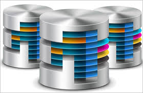

# DataBase

  数据是人们关心的重点，数据组织和存储方式是维护数据的关键和难点

数据库根据不同使用场景可以有很多标签：是持久化，内存缓存？是关系型数据库，Nosql？
key,value类型？是否保证强一致性...等等
  使用哪一种数据库，使用姿势如何，完全取决于业务

   这主要是对使用过的集中DB做记录，目前包括：rocksdbd,mongo,memcache,redis, 如果要贴上标签就是有kv数据库，有缓存数据库，有Nosql数据库,有的只支持内容缓存，有的是内存缓存+持久化，因为业务场景不常使用oracel等强一致性保证的数据库。

   每个数据库都介绍基本使用方式，使用中遇到问题和适用场景作为参考。
